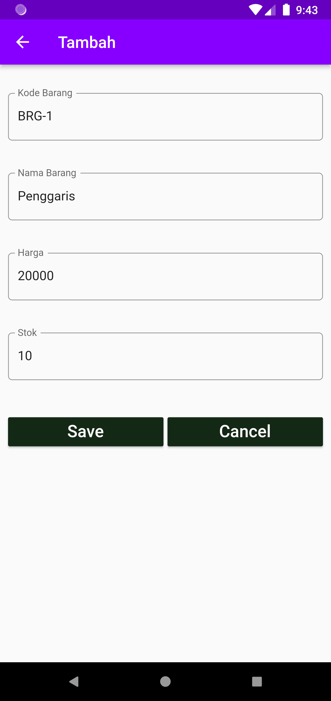
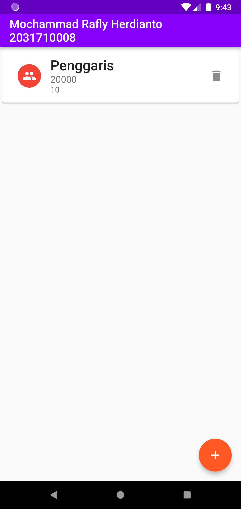
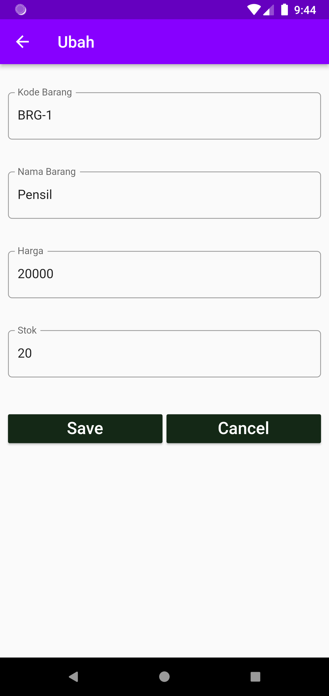
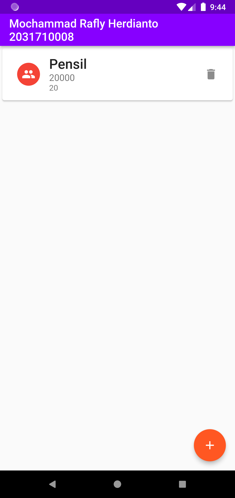

# Tugas 6 Pemrograman Mobile

Membuat Aplikasi Flutter Dengan Database SQLite

Nama  : Mochammad Rafly Herdianto  
NIM   : 2031710008  
Kelas : MI-2C  
Prodi : D3 MI  

## Hasil Praktikum

### Tugas

Halaman Beranda
 

 
Halaman Tambah Data
 

 
Halaman Beranda Ketika Data Berhasil Ditambahkan
 

 
Halaman Ubah Data
 

 
Halaman Beranda Ketika Data Berhasil Diubah
 

 
Halaman Beranda Ketika Data Berhasil Dihapus
 

 
